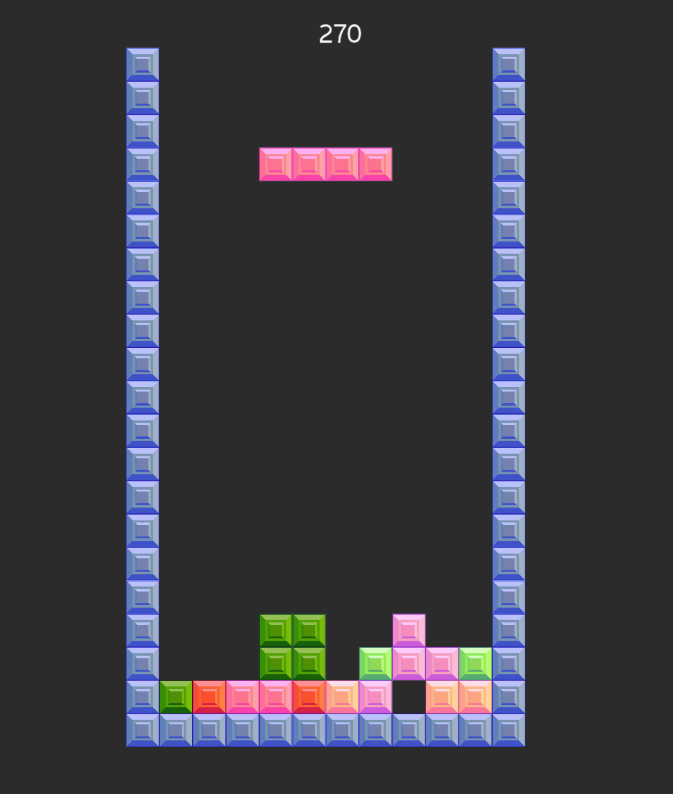

# tetris

Implemented in Kotlin/Korge

Play on your browser: https://yushiomote.github.io/kotris/

## Keys

### Keyboard

* Move left: `Left` or `A`
* Move right: `Right` or `D`
* Soft drop: `Down` or `S`
* Hard drop: `Up` or `W`
* Rotate right: `Z` or `J`
* Rotate left: `X` or `K`

### Mouse/Tap

* Move left/right: Swipe left/right
* Soft drop: Swipe down
* Hard drop: Swipe up
* Rotate left/right: Click/tap left/right side

## Resources

* Images: Moara (Misa Omote) https://atelier-moara.com/
* BGM: Bliss by Luke Bergs | https://soundcloud.com/bergscloud/
  Creative Commons - Attribution-ShareAlike 3.0 Unported
  https://creativecommons.org/licenses/by-sa/3.0/
  Music promoted by https://www.chosic.com/
* Sound: Interface Sound 54 by Junkomry https://junkomory.itch.io/54-interface-sfx-free
